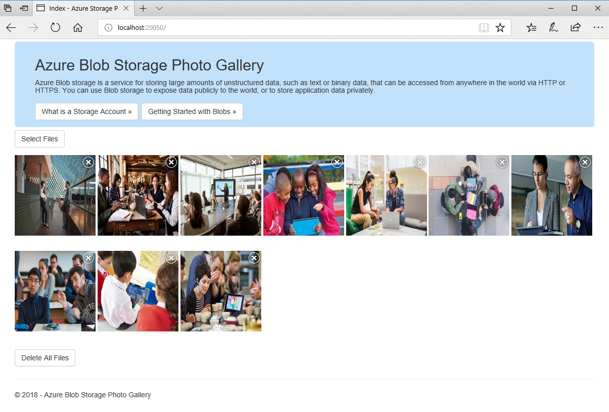

## Solution has been modified to integrate with Azure Active Directory

This is a demo to showcase the uploading of files to Blobstorage from your MVC project leveraging Azure Active Directory :)

In order for the Azure AD to work you need to do the following:

### Get the Client/Application ID from Azure Portal
1. Go to Your [Azure Portal](portal.azure.com) and search for **Active Directory**.
2. Follow this [instruction](https://docs.microsoft.com/en-us/azure/active-directory/develop/quickstart-v1-add-azure-ad-app] to register your app. (*it may be a LITTLE outdated but it is straight forward*)
3. Once you have registered the app. Go **Click** on the app and it will take you to an Overview page.
4. Copy the **Application ID** (*Not the Object ID*)

### Get the Connection String from your Storage Account
1. Go to Your (Azure Portal)[portal.azure.com] and search for **Storage Account**.
  - If you do not have a storage account, please [Create a Storage Account](https://azure.microsoft.com/en-us/documentation/articles/storage-create-storage-account/)  
2. Go to your desired Storage Account then go to **Access Keys**
3. Copy the **Connection String**

**Copy these values into the Web.Config** (I have noted where to put it within the file)

This should allow your application to integrate with Azure Active Directory. Only when you are authenticated, you should be able to see the '**Select File**' button to upload.

Below should give you more detailed instructions to get the application running in general.

---
services: storage
platforms: dotnet
author: perrysk-msft
---

## .NET Photo Gallery Web Application Sample with Azure Blob Storage

This sample application creates a web photo gallery that allows you to host and view images through a .NET web frontend. The code sample also includes functionality for deleting images. At the end, you have the option of deploying the application to Azure.

### Technologies used
- ASP.NET MVC 5
- .NET 4.5
- Azure Storage emulator
- Azure Web Apps
- Azure Storage

Azure Blob Storage Photo Gallery Web Application using ASP.NET MVC 5. The sample uses the .NET 4.5 asynchronous programming model to demonstrate how to call the Storage Service using the Storage .NET client library's asynchronous APIs.

### Running this sample
1. Before you can run this sample, you must have the following prerequisites:
	- The Azure Storage Emulator, which you can download [here](https://go.microsoft.com/fwlink/?linkid=717179&clcid=0x409). You can also read more about [Using the Azure Storage emulator for development](https://docs.microsoft.com/en-us/azure/storage/common/storage-use-emulator).
	- Visual Studio 2015 or Visual Studio 2017.

2. Open the Azure Storage emulator. Once the emulator is running it will be able to process the images from the application.

3. Clone this repository using Git for Windows (http://www.git-scm.com/), or download the zip file.

4. From Visual Studio, open the **WebApp-Storage-DotNet.sln** file from the root directory.

5. In Visual Studio Build menu, select **Build Solution** (or Press F6).

6. You can now run and debug the application locally by pressing **F5** in Visual Studio.

### Deploy this sample to Azure

1. To make the sample work in the cloud, you must replace the connection string with the values of an active Azure Storage Account. If you don't have an account, refer to the [Create a Storage Account](https://azure.microsoft.com/en-us/documentation/articles/storage-create-storage-account/) article.

2. Retrieve the STORAGE ACCOUNT NAME and PRIMARY ACCESS KEY (or SECONDARY ACCESS KEY) values from the Keys blade of your Storage account in the Azure Preview portal. For more information on obtaining keys for your Storage account refer to [View, copy, and regenerate storage access keys](https://azure.microsoft.com/en-us/documentation/articles/storage-create-storage-account/#view-copy-and-regenerate-storage-access-keys)

2. In the **Web.config** file, located in the project root, find the **StorageConnectionString** app setting and replace the placeholder values with the values obtained for your account.

  <add key="StorageConnectionString" value="DefaultEndpointsProtocol=https;AccountName=[Enter Your Storage AccountName];AccountKey=[Enter Your Storage AccountKey]" />

3. In Visual Studio Solution Explorer, right-click on the project name and select **Publish...**

4. Using the Publish Website dialog, select **Microsoft Azure Web Apps**

5. In the next dialog, either select an existing web app, or follow the prompts to create a new web application. Note: If you choose to create a web application, the Web App Name chosen must be globally unique.

6. Once you have selected the web app, click **Publish**

7. After a short time, Visual Studio will complete the deployment and open a browser with your deployed application.

For additional ways to deploy this web application to Azure, please refer to the [Deploy a web app in Azure App Service](https://azure.microsoft.com/en-us/documentation/articles/web-sites-deploy/) article which includes information on using Azure Resource Manager (ARM) Templates, Git, MsBuild, PowerShell, Web Deploy, and many more.

### About the code
The code included in this sample is meant to be a quick start sample for learning about Azure Web Apps and Azure Storage. It is not intended to be a set of best practices on how to build scalable enterprise grade web applications.

### More information
- [What is a Storage Account](http://azure.microsoft.com/en-us/documentation/articles/storage-whatis-account/)
- [Getting Started with Blobs](http://azure.microsoft.com/en-us/documentation/articles/storage-dotnet-how-to-use-blobs/)
- [Blob Service Concepts](http://msdn.microsoft.com/en-us/library/dd179376.aspx)
- [Blob Service REST API](http://msdn.microsoft.com/en-us/library/dd135733.aspx)
- [Blob Service C# API](http://go.microsoft.com/fwlink/?LinkID=398944)
- [Delegating Access with Shared Access Signatures](http://azure.microsoft.com/en-us/documentation/articles/storage-dotnet-shared-access-signature-part-1/)
